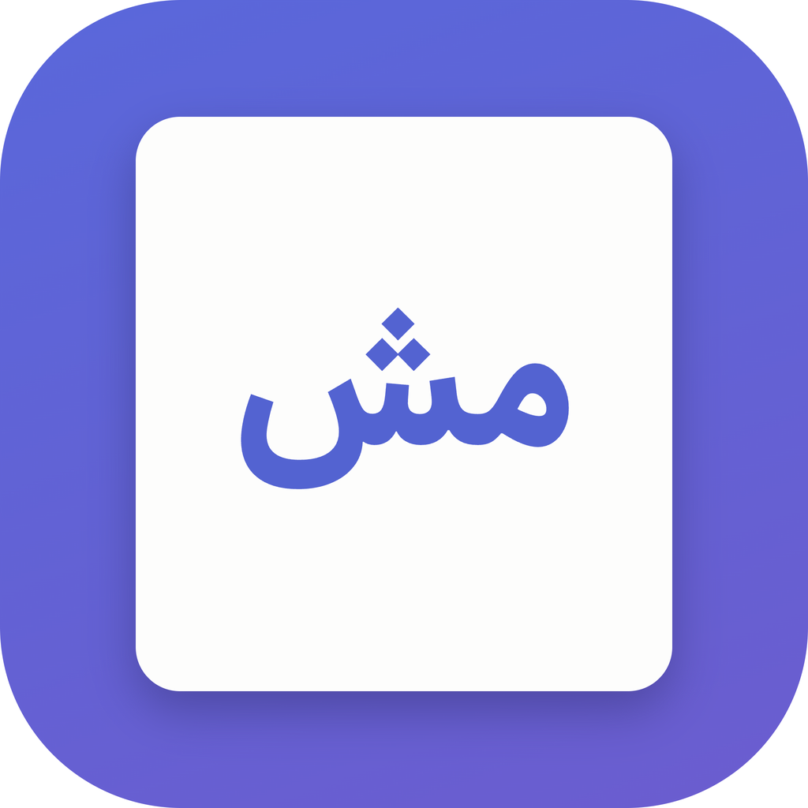

<div align="center">



# مش داوود · MashDavood

**A clean, minimal Markdown reader & editor with first-class Persian / RTL support.**
یک اپلیکیشن ساده و تمیز برای **خواندن و ویرایش Markdown** با پشتیبانی درجه‌یک از **فارسی و راست‌به‌چپ** و فونت **استعداد**.

[](https://github.com/vehij/MashDavood/releases/latest)
[](LICENSE)

</div>

---

## دانلود · Download

| سیستم | فایل |
|---|---|
| **macOS** — Apple Silicon (M1…M4) | [MashDavood-arm64.dmg](https://github.com/vehij/MashDavood/releases/latest/download/MashDavood-arm64.dmg) |
| **macOS** — Intel | [MashDavood-x64.dmg](https://github.com/vehij/MashDavood/releases/latest/download/MashDavood-x64.dmg) |
| **Windows** — نصب‌کننده ۶۴ بیتی | [MashDavood-x64-Setup.exe](https://github.com/vehij/MashDavood/releases/latest/download/MashDavood-x64-Setup.exe) |
| **Windows** — بدون نصب (Portable) | [MashDavood-x64-Portable.exe](https://github.com/vehij/MashDavood/releases/latest/download/MashDavood-x64-Portable.exe) |
| **Windows** — اگر مرورگر جلوی exe را گرفت | [MashDavood-x64-win.zip](https://github.com/vehij/MashDavood/releases/latest/download/MashDavood-x64-win.zip) |
| **Windows** — ARM | [MashDavood-arm64-Setup.exe](https://github.com/vehij/MashDavood/releases/latest/download/MashDavood-arm64-Setup.exe) |

این لینک‌ها **همیشه آخرین نسخه** را می‌دهند (نام فایل‌ها شماره‌ی نسخه ندارد)، پس می‌شود
همین‌ها را برای هم‌تیمی‌ها فرستاد. فهرست کامل و تغییرات هر نسخه:
**[Releases](https://github.com/vehij/MashDavood/releases/latest)**.

اپ امضای دیجیتال اپل/مایکروسافت ندارد (باینری تازه و امضانشده = بی‌اعتبار از نظر
سیستم‌عامل)، پس بار اول:

- **macOS**: بعد از کپی به `Applications`، اگر باز نشد:
  ```bash
  xattr -dr com.apple.quarantine /Applications/MashDavood.app
  ```
- **Windows**: در پیام SmartScreen روی *More info* → *Run anyway*. اگر مرورگر فایل را
  «خطرناک» خواند یا برنامه بعد از نصب باز نشد، راهنمای کامل:
  **[docs/WINDOWS.md](docs/WINDOWS.md)**

صحت فایل‌ها با `SHA256SUMS-*.txt` در همان Release قابل بررسی است.

---

## چه کاری می‌کند

**نمایش و ویرایش**
- نمای دوستونه: سورس مارک‌داون در یک ستون، پیش‌نمایش زنده در ستون دیگر، با **اسکرول همگام**
- سه حالت: فقط ویرایش (⌘1) · دوستونه (⌘2) · فقط خواندن (⌘3)
- تب‌های چندگانه، بازیابی نشست قبلی، سایدبار فایل‌ها و پنل فهرست مطالب (Outline)
- ذخیره خودکار (قابل خاموش کردن) + نشانگر تغییرات ذخیره‌نشده + تشخیص تغییر فایل روی دیسک
- Drag & Drop، فایل‌های اخیر، باز شدن مستقیم با دابل‌کلیک روی `.md`

**فارسی و RTL**
- جهت **هر پاراگراف، تیتر و آیتم لیست** به‌صورت خودکار از روی متن تشخیص داده می‌شود؛ سند دوزبانه درست نمایش داده می‌شود
- در ویرایشگر جهت **هر خط** جداگانه تشخیص داده می‌شود و علائم مارک‌داون (`-`, `1.`, `#`, `[x]`) نادیده گرفته می‌شوند تا لیست فارسی درست راست‌چین شود
- انتخاب متن (سلکشن) در متن ترکیبی فارسی/انگلیسی دقیقاً روی همان کاراکترها می‌نشیند
- شماره‌گذاری لیست‌های فارسی با ارقام فارسی (۱، ۲، ۳)
- قفل کردن جهت روی RTL یا LTR (⇧⌘R / ⇧⌘D / ⇧⌘A برای خودکار)
- فونت **استعداد** برای رابط و پیش‌نمایش؛ در ویرایشگر هم برای متن فارسی استعداد و برای کد مونواسپیس

**محتوای مارک‌داون**
- تیتر، لیست، چک‌لیست، جدول، نقل‌قول، پانویس، `mark`، زیرنویس/بالانویس، دیفینیشن‌لیست
- بلوک‌های هشدار گیت‌هابی: `> [!NOTE]` · `> [!WARNING]` · `> [!TIP]` · `> [!DANGER]`
- **نمودار Mermaid** با تم روشن/تیره · **فرمول ریاضی** با KaTeX · رنگ‌آمیزی کد + دکمه کپی
- Front-matter (YAML)، تصاویر با مسیر نسبی، لینک بین فایل‌های md
- **خروجی PDF و HTML** با همان فونت، جهت و نمودارها

---

## میان‌برها

روی ویندوز ⌘ را Ctrl و ⌥ را Alt بخوانید (خود اپ هم آن‌ها را ترجمه می‌کند).

| کار | کلید |
|---|---|
| باز کردن فایل / پوشه | ⌘O / ⇧⌘O |
| فایل جدید | ⌘N |
| ذخیره / ذخیره به‌نام | ⌘S / ⇧⌘S |
| بستن تب · تب بعدی/قبلی | ⌘W · ⌃Tab / ⌃⇧Tab |
| حالت ویرایش · دوستونه · خواندن | ⌘1 · ⌘2 · ⌘3 |
| سایدبار · تم روشن/تیره | ⌘\ · ⇧⌘L |
| جهت: خودکار / RTL / LTR | ⇧⌘A / ⇧⌘R / ⇧⌘D |
| جستجو در سند | ⌘F |
| بولد / ایتالیک / لینک | ⌘B / ⌘I / ⌘K |
| کد درون‌خطی / بلوک کد | ⇧⌘C / ⌥⌘C |
| تیتر ۱ تا ۳ | ⌥⌘1 تا ⌥⌘3 |
| لیست نقطه‌ای / شماره‌دار / چک‌لیست | ⇧⌘8 / ⇧⌘7 / ⇧⌘9 |
| نقل‌قول · جدول · نمودار Mermaid | ⇧⌘. · ⌥⌘T · ⌥⌘M |
| خروجی PDF / HTML | ⌘P / ⇧⌘E |
| بزرگ‌نمایی / کوچک‌نمایی / اندازه اصلی | ⌘+ / ⌘− / ⌘0 |
| تنظیمات | ⌘, |

تنظیمات (⌘,): تم، جهت پیش‌فرض، فونت و اندازه ویرایشگر، ارتفاع خط، عرض ستون، ذخیره خودکار، غلط‌یاب.

---

## Build from source

```bash
npm install
npm run dev          # Vite dev server
npm run electron:dev # اجرای اپ در حالت توسعه (در ترمینال دوم)

npm run dist         # ساخت نصب‌کننده برای سیستم فعلی → release/
npm run dist:win     # فقط ویندوز   (روی مک نیاز به Wine دارد)
npm run dist:mac     # فقط مک‌او‌اس
```

روی مک، برای نصب کامل + ثبت به‌عنوان اپ پیش‌فرض `.md` + نصب فونت:

```bash
./scripts/install.sh
```

انتشار نسخه جدید: یک تگ بزنید، GitHub Actions هر دو نسخه را می‌سازد و در Releases می‌گذارد.

```bash
git tag v1.0.1 && git push --tags
```

---

## Project layout

```
electron/    main process — window, native menu, dialogs, fs, watchers, PDF/HTML export
src/
  styles/    app.css (shell) · markdown.css (preview) · editor.css (CodeMirror)
  renderer/  app.js (state, tabs, sidebar, scroll sync, exports)
             markdown.js (markdown-it + KaTeX + Mermaid + direction + outline)
             editor.js (CodeMirror 6, per-line direction, formatting commands)
assets/      Estedad variable font (OFL)
build/       app icons
docs/        ARCHITECTURE.md · PROGRESS.md · نمونه سند فارسی
scripts/     install.sh · cdp.mjs (headless UI testing) · set-default-md-app.swift
```

جزئیات فنی: [docs/ARCHITECTURE.md](docs/ARCHITECTURE.md) — وضعیت و کارهای بعدی: [docs/PROGRESS.md](docs/PROGRESS.md)

---

## Credits

- فونت [استعداد](https://github.com/aminabedi68/Estedad) — SIL OFL 1.1
- [CodeMirror 6](https://codemirror.net) · [markdown-it](https://github.com/markdown-it/markdown-it) · [Mermaid](https://mermaid.js.org) · [KaTeX](https://katex.org) · [Electron](https://electronjs.org)

MIT © Vahid Yaghoubian
