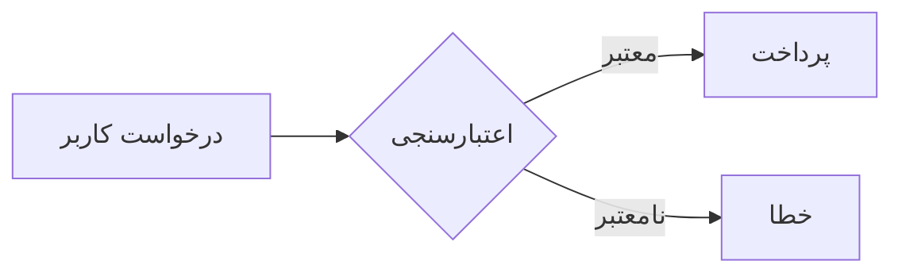

# گزارش پروژه سامانه پرداخت

این متن **فارسی** است و باید کاملاً راست‌به‌چپ نمایش داده شود. اعداد مثل ۱۲۳ و 456 و کلمات انگلیسی مثل `API` و *inline* باید درست جا بگیرند.

This is an English paragraph in the same document. It must render left to right, with its own alignment.

## ویژگی‌ها

- مورد اول با توضیح کوتاه
- مورد دوم که شامل `کد درون‌خطی` است
- مورد سوم
  - زیرمورد ۱
  - زیرمورد ۲

1. گام نخست
2. گام دوم
3. گام سوم

### فهرست کارها

- [x] تحلیل نیازمندی‌ها
- [ ] پیاده‌سازی
- [ ] تست

## جدول

| نام | نقش | وضعیت |
|---|---|---|
| سمانه | مدیر محصول | فعال |
| وحید | توسعه‌دهنده | فعال |

> [!WARNING]
> این یک هشدار است و باید با رنگ متفاوت نمایش داده شود.

> نقل‌قول ساده فارسی برای بررسی حاشیه سمت راست.

## نمودار



## کد

```python
def hello(name: str) -> str:
    return f"سلام {name}"
```

## ریاضی

فرمول درون‌خطی $a^2 + b^2 = c^2$ و بلوکی:

$$
\sum_{i=1}^{n} x_i = \frac{n(n+1)}{2}
$$

---

پایان سند. [لینک به گوگل](https://google.com)
